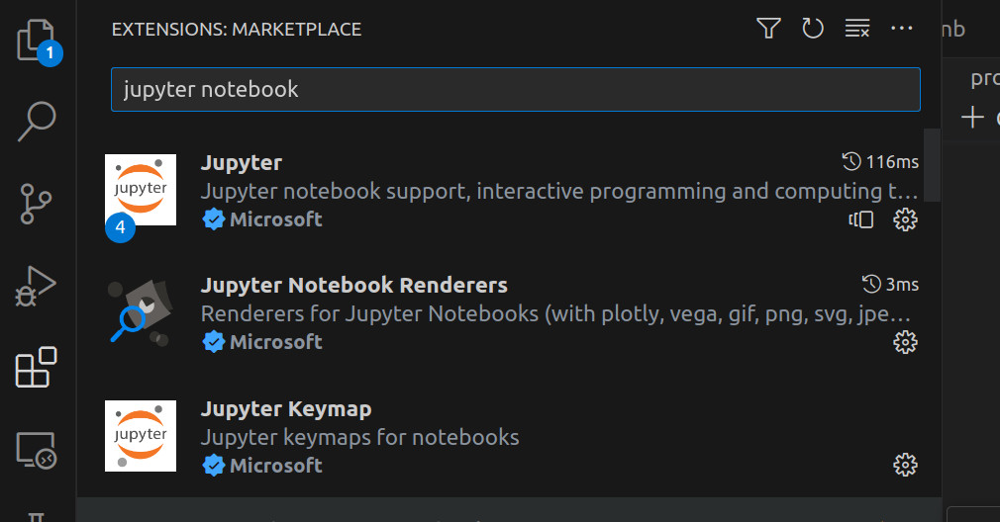
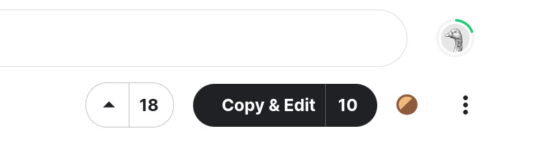
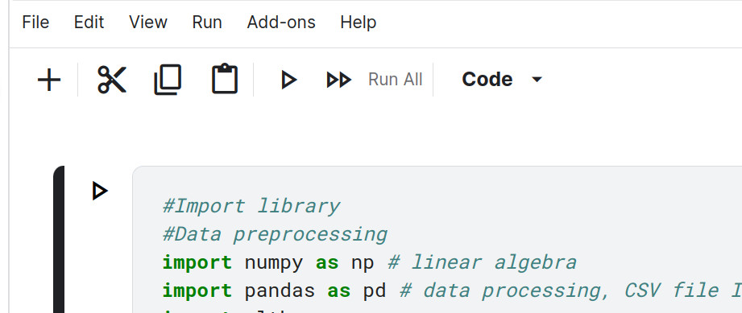

# Homework

## Github

i. Create Github Account at [Github](https://github.com/)

## Jupyter Notebooks

### Option 1. VS code (Optional but Prefered)

#### i. Install Vscode

- install: [https://code.visualstudio.com/download](https://code.visualstudio.com/download)

- intro: [https://www.youtube.com/watch?v=B-s71n0dHUk](https://www.youtube.com/watch?v=B-s71n0dHUk)

#### ii. Create Environment

- [https://code.visualstudio.com/docs/python/environments](https://code.visualstudio.com/docs/python/environments)

- nice vídeo explanation : [https://www.youtube.com/watch?v=eWk497uCgf0](https://www.youtube.com/watch?v=eWk497uCgf0)

#### iii. Install libraries

- install tutorial: [https://www.alphr.com/vs-code-how-to-install-numpy/](https://www.alphr.com/vs-code-how-to-install-numpy/)

- install libraries pandas, numpy, seaborn, matplotlib.

#### ii. Install Jupyter Notebook extention

#### iii. Ctrl+P (or Cmd+P) – search for "jupyter notebook"

tutorial vídeo: [https://www.youtube.com/watch?v=h1sAzPojKMg](https://www.youtube.com/watch?v=h1sAzPojKMg)

### Option 2. Kaggle

#### i. Sign In

#### ii. Find Class URL

- url class 1.1 - [https://www.kaggle.com/santosjgnd/distributions-class-distrbutions-1-1](https://www.kaggle.com/santosjgnd/distributions-class-distrbutions-1-1)

#### iii. Copy and Edit

#### iv. Play

#### v. Change name & Share

