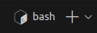

## Install Git and VS Code on Windows

### Git Bash

- Download and install Git Bash from [https://git-scm.com/downloads](https://git-scm.com/downloads)

- Open Git Bash and run the following commands:

```bash
git config --global user.name "Your Name"
git config --global user.email "Your Email"
```

### Python (if not installed)

- type `python`, windows will ask you to install python, click `get` and install it.

### Git

i. cloning the repository

- `cd` to the folder where you want to clone the repository, for example:

```bash
cd /c/Users/YourName/Documents
```

- clone the repository:

```bash
git clone git@github.com:SantosJGND/SI_NOTEBOOKS.git
```

### VS Code

To use git-bash in VS Code, you need to install VS Code and the extension `Start git-bash`.

- see note in main README.md to install VS Code and VS Code extensions.

### Starting a New Project

- Open VS Code.

- If you're not already in the welcome page, click `Ctrl-N` to open a new window.

- Select a folder to create a new project. If you have cloned the repository, select the folder where you cloned the repository.

### The Command Line Terminal

- click `Ctrl-Shift-Y` to open the terminal panel.

- Open the dropdown menu next the `+` sign and select the option that `Git Bash`.
  

- You can now use this terminal to run git commands.

### Creating an Environment

When working on a project, it is good practice to create a virtual environment for that project. This way, you can install the libraries you need for that project without affecting other projects.

- Open the command line terminal.
- type:

```bash
python -m venv .venv
```

- This will create a folder called `.venv` in your project folder. This folder will contain the python interpreter and the libraries you install for this project.

- To activate the environment, type:

```bash
source .venv/Scripts/activate
```

- You should see the name of the environment in the terminal prompt.
- VS Code will automatically detect the environment and ask you if you want to use it. Click `Yes`.
- Alternatively, click `Ctrl-Shift-P` and type `Python: Select Interpreter`. Select the interpreter in the `.venv` folder. Notice you can select any other interpreter you have installed in your computer. This will be useful later.

### Installing Libraries

- To install libraries, type:

```bash
python -m pip install pandas numpy matplotlib seaborn
```

**Note:** using `python -m pip` instead of `pip` ensures that you are using the pip version that is installed in the environment.
